# SPIE Medical Imaging 2019
## Sunday
### Deep Learning Session 1
#### AI + Medical Imaging in China: Present and Future
- Presenter Dr. Shiyuan Li from Changzheng Hospital in China
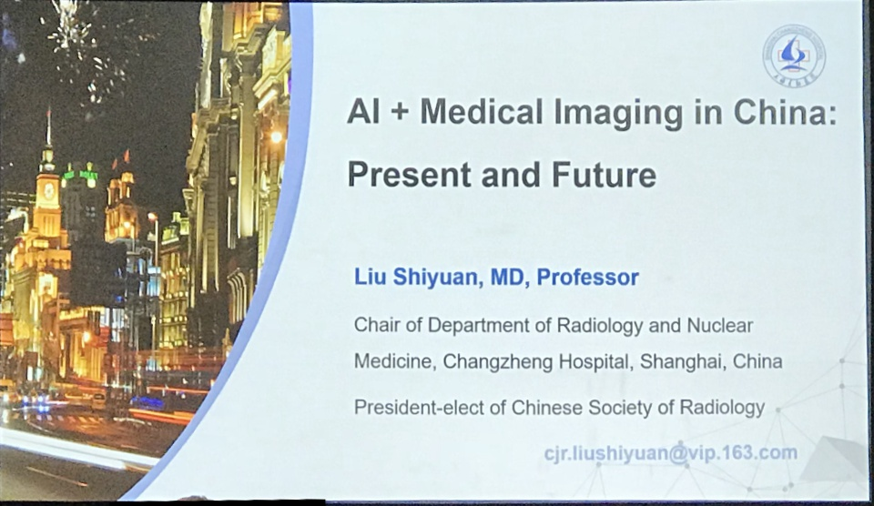
- High quality medical services are needed
	- Aging population
- Pain point of Medical Imaging in China
	- Inaccurate diagnosis
	- Scarcity of supply: 20% annual growth rate of data, 4.1% of radiologists
	- Low efficiency
- AI + Medicine
	- Disease detection
	- Lesion quantification
	- Malignancy diagnosis
	- Therapeutic evaluation
- Compared with US, China has way too many medical imaging AI company, but not enough new drug discovery, patient management, etc. 
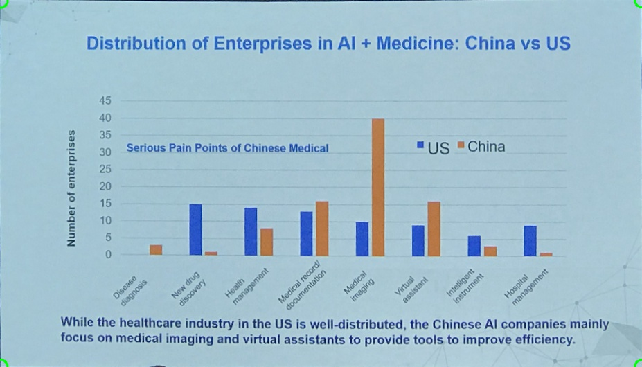
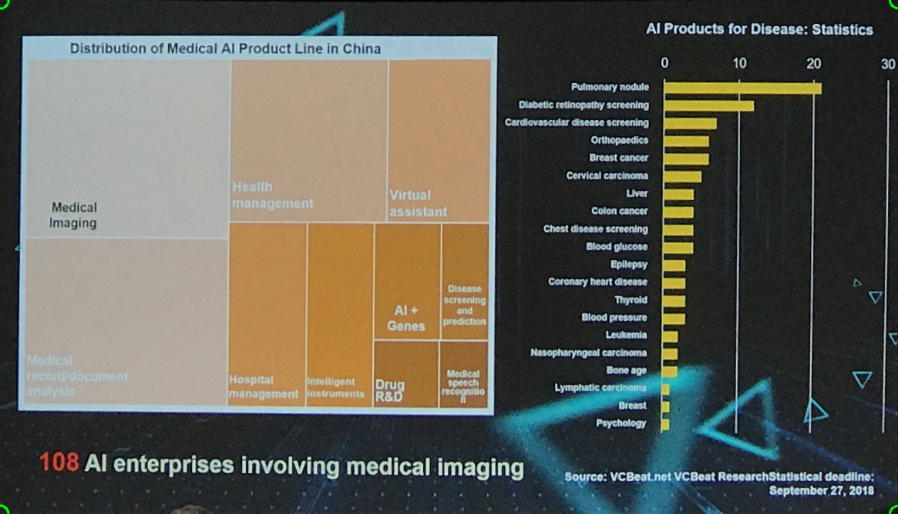
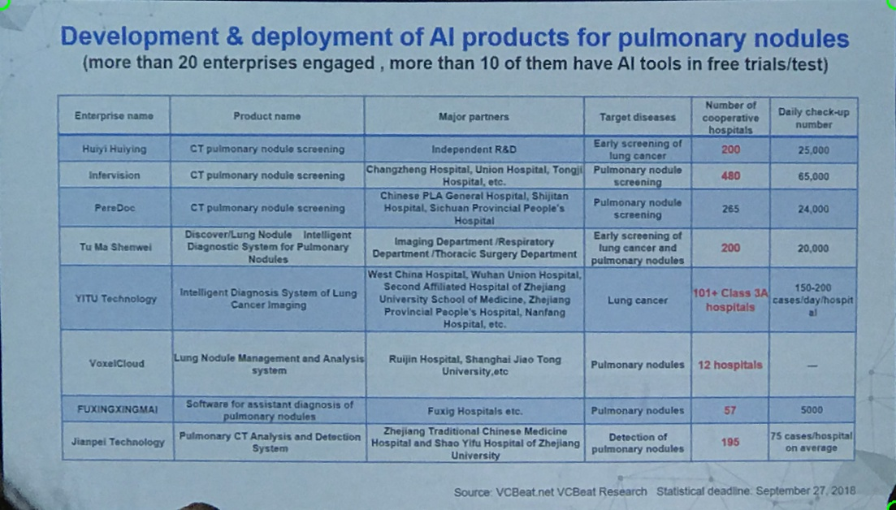
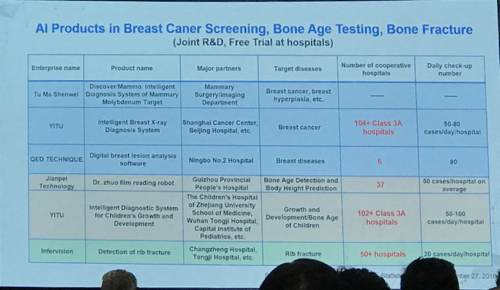
- Usage:
	- lung nodule: daily use
	- fracture and ICH: ER
- Iterative AI model
	- Refinement using hospital data
	- False positives gradually reduce to acceptable levels
- AI tool for measuring intracerebral hemorrhage (ICH)
	- x ml --> y ml
- Bone Age analysis
	- Parents height, child's height and weight, evaluates the status of the child's growth (too over-weight? ahead of the growth curve)
	- Shows the growth curve (height/weight vs age), and the child's position (a single point) in the curves
- Large medical imaging database
	- National Database of ultrasound
	- National radiology database
- CFDA
	- Class II: assistive diagnostic suggestion/recommendation, regulated by local provincial FDA
	- Class III: give definitive diagnostic suggestion/recommendation, regulated by CFDA

#### Impact of imprinted labels on deep learning classification of AP and PA thoracic radiographs
- PA: Size of hard shadow, visual cues: scapula/clavicle positions
- a CNN classifier to classify AP/PA
- 2000 images, may contain foreign objects, 65:20:15 splits
- Wording of imprinted labels: portable, AP, Erect, semi erect
- 97% ROC AUC for images with labels, 95% ROC AUC for images without labels
- Q&A:
	- Only DR is used
	- AP often contain more foreign objects
	- No CAM is used to visualize, this is the next step

#### Deep learning method for tumor segmentation in breast DCE-MRI
- previous methods: fuzzy c-means (Zhang et al), watershed
- 2D vs 3D methods: U-Net used
- data: slices with tumors
- 3D U-Net has fewer false positives
- Q&A:
	- Test: how about false positives in healthy regions? ROI is specified by doctors. This is only for segmentation.
	- Patient split: yes

	
### Deep Learning Session 2
#### Optic disc segmentation in fundus images 
- MWSSIDOR, open dataset, 1200 images
- ROI abstracted from fundus images with RetinaNet
- Segmentation done with U-Net

#### Learning cross-protocol radiomics and deep feature standardization from CT images of texture phantoms
- Standardize features across scanners
- Texture phantom scanned by various scanners
- Classify scanned texture to learn features stable across scanners
- Domain adversarial training with gradient reverse layer to forget about domain
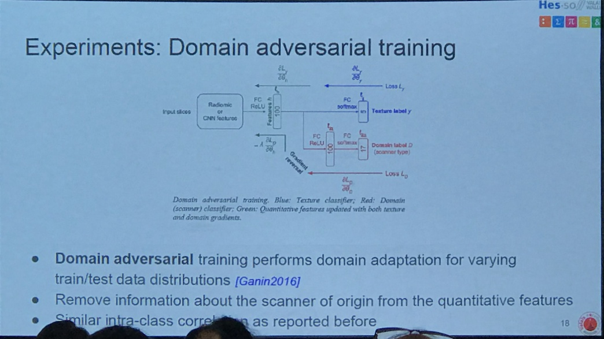

#### A data interpretation approach for deep learning-based prediction models
- Model interpretability
	- Radiomics vs deep learning
- CNN is **ruthless** in finding discriminative features. Here is a cool story [from the Pentagon](https://www.analyticsvidhya.com/blog/2018/03/essentials-of-deep-learning-visualizing-convolutional-neural-networks/).
- Scheme 1: modify input images to examine CNN models wrt changes in ROI (occlusion test)
	- 4x4 grid: keep information inside one grid, but mask all other 15 girds (This does not quite make sense)
- Scheme 2: CAM based methods
- Notes: not very convincing

### Breast III and Heart
#### Visual evidence for interpreting diagnostic decision of deep neural network in computer-aided diagnosis
- Deep learning has limited interpretability
- Solution: CAM (class activation map) or gradCAM
- Inspired by Radiologists' interpretation: BI-RADS
- Margin interpretation + shape interpretation
	- Interpretation loss
	- Consistency loss
	- Extra supervision loss
- Note: the losses are too complicated to replicate

#### U-Net inspired architecture ensembles for left atrial segmentation
- Ensemble of 15 different U-Net based on different feature extractors (ResNet, DenseNet, SENet, etc)
- Some individual model has wide error bars
- The ensemble model does not have clear efficiency over some of the good performing models

## Monday
### Deep Learning
#### Large-scale evaluation of multiresolution V-Net for organ segmentation in image guided radiation therapy
- From United Imaging, trtment planning
- Coarse to fine. Downsample, use v-net to get mask, then crop patches, feed into v-net, segment
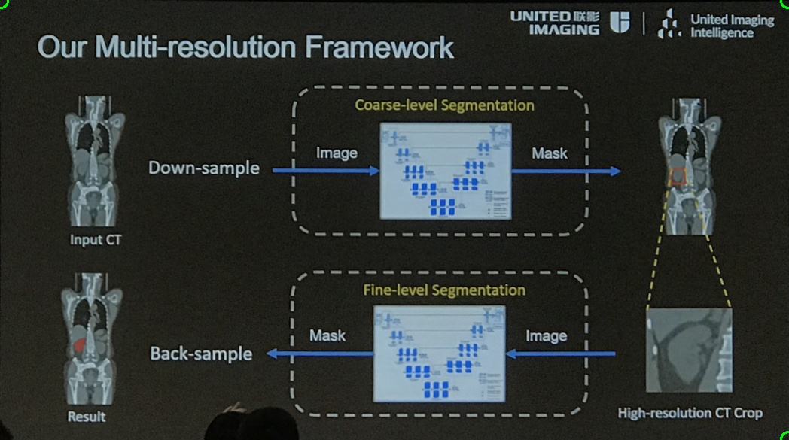
- Model compression and memory consumption
	- V-net too large for production. 
		- Reduce kernel size (5x5x5 --> 3x3x3): 250 MB --> 57 MB
		- Use bottleneck to replace conv layers with large channel sizes. Output_ch x input_ch x K x K x K ~ num of channels. C x C x 3 --> C/N x C x 1 x 1 x 1 --> C/N x C/N x 3 x 3 x 3 --> C x C/N x 1 x 1 x 1. N = 4 --> a factor of 12 compression ratio. 250 MB --> 57 MB --> 8.8 MB.
	- GPU memory use: downsample image by 2
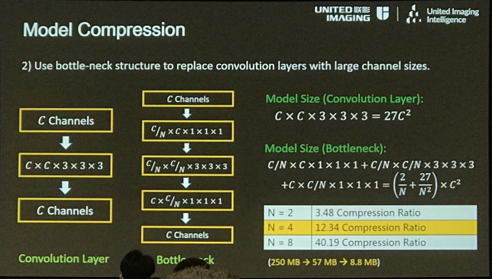
- GTX 1080 card, 0.7 second
- Demo: Atlas based: 3 min, V-Net: 7 seconds. More accurate than atlas based methods, e.g. in liver tips.
- United Imaging used highly optimized backend (cuda lib) for inference. Pytorch and TF use too much memory for inference.
- Dice loss is better than cross entropy
	- Dice loss does not lead to overfitting
	- Cross entropy (weighted version or focal loss) often overfits and requires validation set to pick a model. This is not always possible as the validation set is too large to evaluate after every epoch.

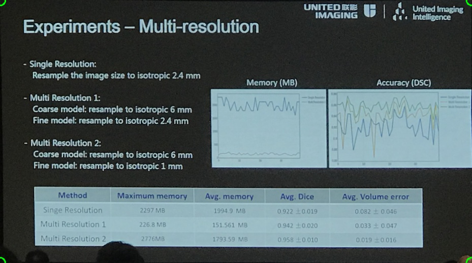

#### StreoScenNet: surgical stereo robotic scene segmentation
- This talk is very interesting.
- End to end training of a single network for all tasks
- multi-encoder and single decoder
- Each encoder initialized with imagenet weights. 
	- binary segmentation
	- instrument segmentation
	- part segmentation
- The results of each encoder is summed, concatenated with the same level of decoder, and generating 3 masks. 
- Data: MICCAI 2917 endoscopic challenge
	- Left and right. only left are annotated
- Q&A:
	- enforce consistency? no. the author does not think that would matter much.
- This is very similar to the [Y-Net](https://arxiv.org/abs/1806.01907).

### Deep learning based 2.5D flow field estimation for maximum intensity projections of 4D optical coherence tomography
- OCT: cloud points?
- Flat 3D to 2D with MIP along depth
- census transform
- Overall approach:
	- Approximate x, y flow, then align x, y and concate and estimate the z-flow.
- Encoder-decoder: [ERFnet](http://www.robesafe.uah.es/personal/eduardo.romera/pdfs/Romera17tits.pdf)
- Multi-loss, but the strong supervised loss is not needed for convergence.
- Level-wise training is critical for convegence
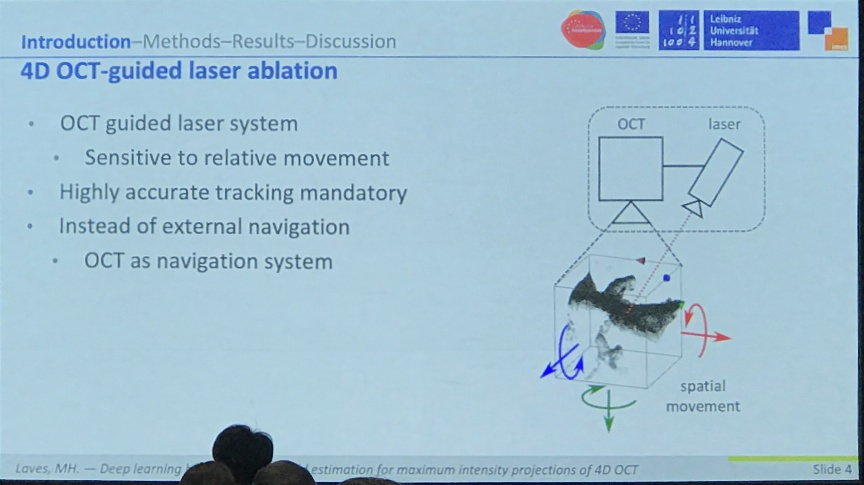
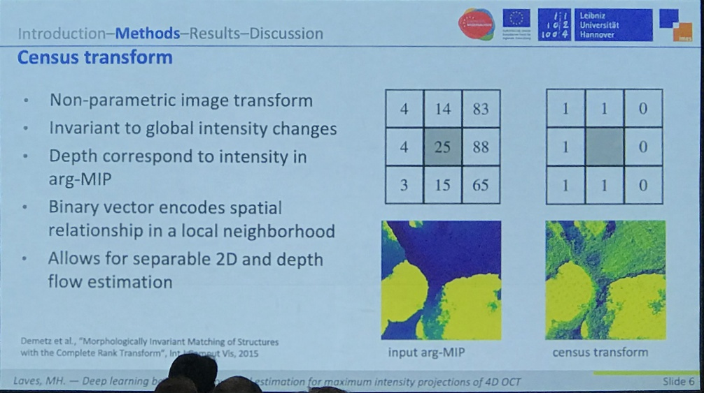
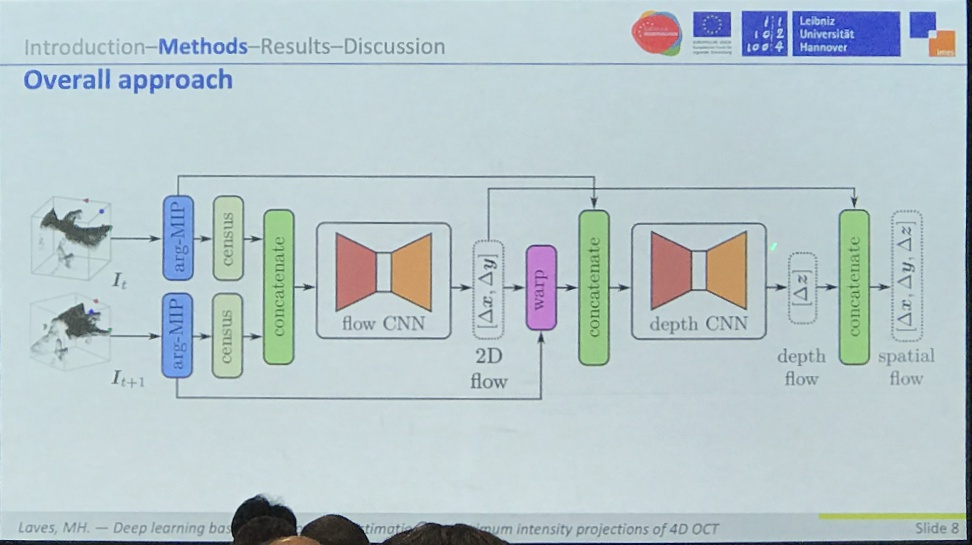

### Automatic vertebrae localization in spine CT: a deep-learning approach for image guidance and surgical data science
- From Jeffrey Siewerdsen's group
- Challenge: variable imaging protocol, poor image quality, foreign objects
- YOLO to regress points. Essentially get rid of width and height loss terms.
- 2D vs 3D:
	- 2D on each slice, but use aggregation network to combine the feature maps to regress x, y, z centroid
	- 2D takes significantly less resource
	- Not very stable
- Deeper network, use imagenet pre-train
	- Use detection sagittal slices and coronal slices
- Faster RCNN ortho 2D gives best results
- GT and prediction are in 3D, visualization are in 2D
- Used closest GT for evaluation
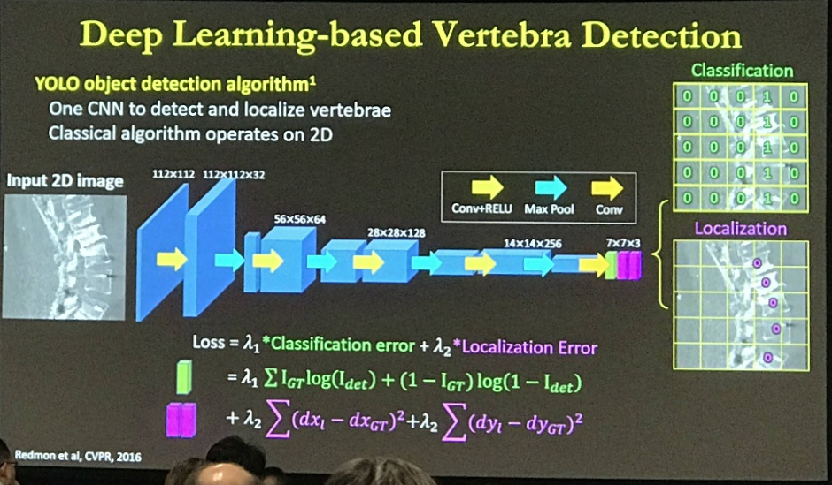
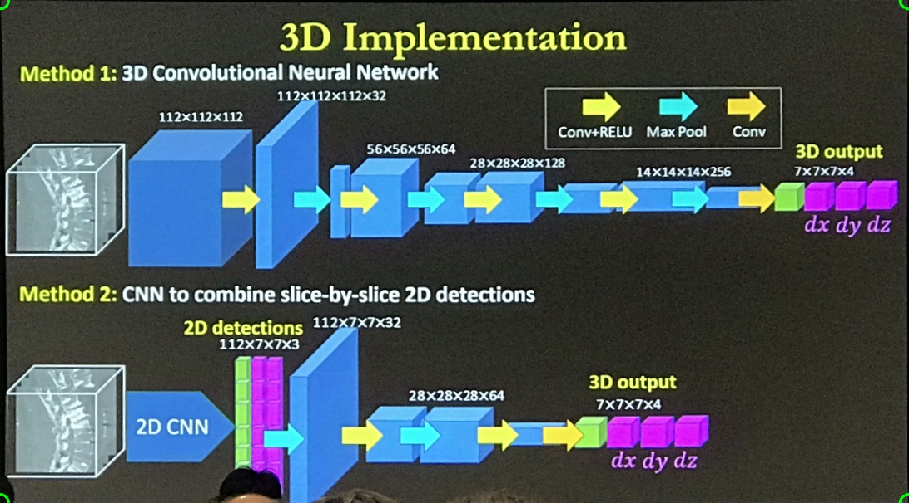
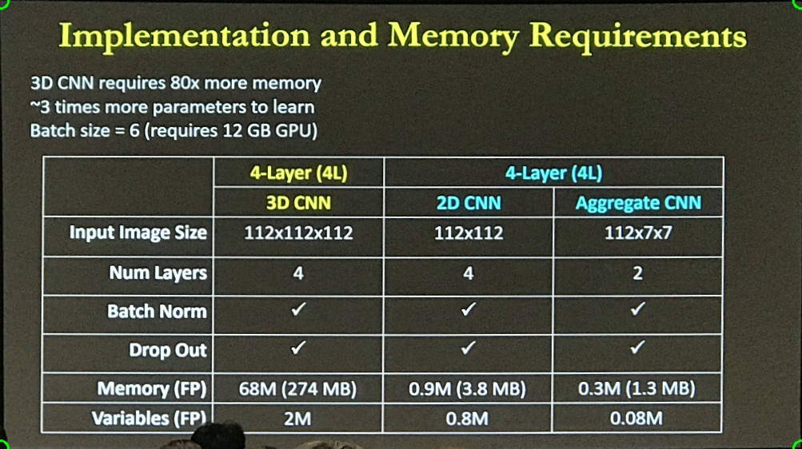
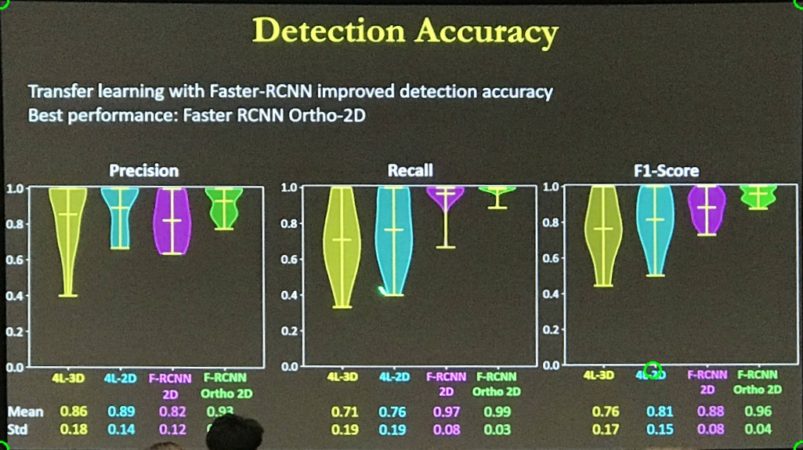
